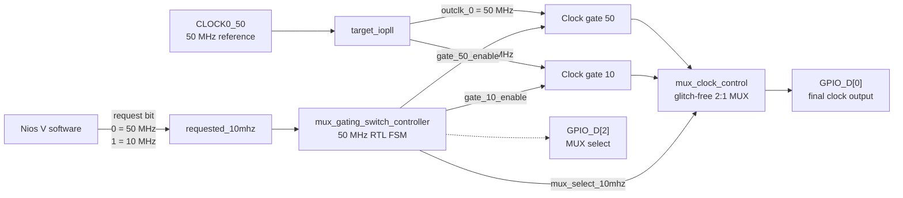
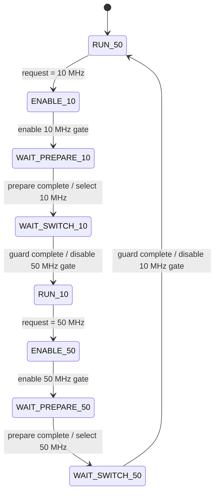
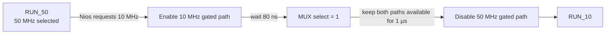

# Agilex 5 HVIO IOPLL 50 MHz ↔ 10 MHz MUX + Root Gating

This repository implements **runtime switching between two continuously generated IOPLL clocks** using dedicated clock-gating resources followed by a glitch-free Clock Control MUX.

> **Current design:** HVIO IOPLL continuously generates 50 MHz and 10 MHz → RTL enables the target gated path → waits a programmable preparation interval → changes the MUX select → keeps both paths available for a guard interval → disables the old gated path.

The normal 50 MHz ↔ 10 MHz transition **does not dynamically reconfigure the IOPLL**. The IOPLL register interface is held idle in `mux_gating_top.v`; M/N/C settings are not rewritten during a frequency switch.

---

## 1. System architecture



### Clock path

```text
IOPLL outclk_0 (50 MHz) ──> gate 50 ──┐
                                      ├─> glitch-free MUX ──> final output
IOPLL outclk_1 (10 MHz) ──> gate 10 ──┘
```

The two IOPLL outputs continue running continuously. Clock gating only controls whether each clock propagates into the downstream MUX input.

Therefore:

- gate OFF does **not** stop the IOPLL,
- gate ON does **not** start or relock the IOPLL,
- normal frequency switching does **not** perform PLL reset, C-counter reconfiguration, or recalibration.

---

## 2. Nios V and RTL responsibilities

Nios V does **not** directly control precise gate or MUX timing.

The software only writes one requested-frequency bit:

```c
request_frequency(0u); // request 50 MHz
request_frequency(1u); // request 10 MHz
```

The current application keeps each requested frequency for approximately one second. All short switching intervals are generated by `mux_gating_switch_controller.sv`.


---

## 3. Actual RTL state machine

The current controller contains **eight states**:

```text
RUN_50
ENABLE_10
WAIT_PREPARE_10
WAIT_SWITCH_10
RUN_10
ENABLE_50
WAIT_PREPARE_50
WAIT_SWITCH_50
```

There are **no `MUX_TO_10` or `MUX_TO_50` states** in the current RTL.

The MUX select changes directly when the preparation counter completes in `WAIT_PREPARE_*`, or in `ENABLE_*` when `PREPARE_CYCLES == 0`.



### `PREPARE_CYCLES == 0`

When `PREPARE_CYCLES` is zero:

- target gate enable and the MUX command occur on the same 50 MHz control edge,
- the old gated path still remains enabled through the switch guard.

---

## 4. 50 MHz → 10 MHz switching sequence

Default parameters:

```systemverilog
PREPARE_CYCLES      = 4
SWITCH_GUARD_CYCLES = 50
```

The FSM runs from the 50 MHz system clock:

```text
1 control cycle = 20 ns
PREPARE_CYCLES = 4      -> 80 ns
SWITCH_GUARD_CYCLES = 50 -> 1 µs
```

### Forward transition



Equivalent sequence:

```text
50 MHz running
    ↓
Nios requests 10 MHz
    ↓
enable 10 MHz gated path
    ↓
wait PREPARE_CYCLES
    ↓
MUX select changes to 10 MHz
    ↓
wait SWITCH_GUARD_CYCLES with both paths enabled
    ↓
disable old 50 MHz gated path
    ↓
10 MHz running
```

The reverse 10 MHz → 50 MHz sequence is symmetric.

This is a **make-before-break** clock-path strategy: the target clock path is made available before the old path is removed.

---

## 5. MUX select vs. internal marker signals

The signal that directly changes which clock source is selected is:

```text
mux_select_10mhz
```

Its meaning is:

```text
0 -> select gated 50 MHz path
1 -> select gated 10 MHz path
```

This is the signal exported for oscilloscope correlation on `GPIO_D[2]`.

The controller also contains internal signals such as `prepare_marker` and `transition_marker`. These are useful for RTL/debug interpretation, but **they are not part of the current two-signal GPIO measurement setup**.

In particular, `prepare_marker` remains asserted from target-gate enable through the switch guard until the old path is disabled, so it should not be interpreted as an 80 ns-only pulse.

---

## 6. GPIO measurement interface used in this experiment

The current experiment uses only **two GPIO signals for oscilloscope measurement**:

| GPIO | Signal | Purpose |
|---|---|---|
| `GPIO_D[0]` | `mux_gating_clock_out` | Final output clock after gating and MUX |
| `GPIO_D[2]` | `mux_select_10mhz` | MUX selection command used as transition reference |

That is the complete external measurement interface used for the captures in this repository.

### Oscilloscope connection

```text
CH1 -> GPIO_D[0] -> final clock output
CH2 -> GPIO_D[2] -> MUX select
```

For a **50 MHz → 10 MHz** transition:

```text
GPIO_D[2]: 0 -> 1
```

For a **10 MHz → 50 MHz** transition:

```text
GPIO_D[2]: 1 -> 0
```

The MUX-select edge is therefore the clean external reference for correlating the command with the observed output transition.

---

## 7. What the current oscilloscope captures prove

Because the experiment currently observes only:

```text
final output + MUX select
```

the captures directly show the relationship between the **MUX command** and the **final output behavior**.

They do **not** directly expose the individual internal gate-enable signals. Therefore, the board captures should not be presented as direct analog proof of the exact target-gate-enable time or old-gate-disable time.

Those ordering rules come from the RTL implementation:

```text
target path enabled
    ↓
PREPARE_CYCLES
    ↓
MUX command
    ↓
SWITCH_GUARD_CYCLES
    ↓
old path disabled
```

This distinction is important: the oscilloscope experiment measures the externally visible switching behavior, while the RTL defines the internal gating sequence.

---

## 8. Hardware captures — 50 MHz → 10 MHz

The three captures show the same transition at progressively shorter time scales.

### 1. Overview — 50 ms/div


This capture shows the overall transition from the faster 50 MHz output region to the slower 10 MHz output region.

### 2. Transition zoom — 2 ms/div


This view zooms in around the `GPIO_D[2]` MUX-select edge and the corresponding final-output transition.

### 3. Boundary close-up — 500 µs/div


This is the closest view in the current capture set.

### Signals in the captures

- **Yellow / output:** `GPIO_D[0]` — final clock output.
- **Blue / MUX select:** `GPIO_D[2]` — `mux_select_10mhz`.

The `GPIO_D[2]` rising edge is the **50 MHz → 10 MHz command**.

At these millisecond-scale timebases, the 50 MHz and 10 MHz clocks are heavily undersampled by the displayed waveform. The screenshots are useful for visualizing the transition region, but they should not be used alone for nanosecond-level pulse-width or runt-pulse claims.

---

## 9. Measurement definitions

For the current two-signal setup, the most relevant quantities are:

| Metric | Definition |
|---|---|
| `T_switch` | Time from the `GPIO_D[2]` MUX-select edge to the first clearly valid edge/period of the newly selected output frequency on `GPIO_D[0]` |
| `T_gap` | Time from the last valid old-frequency edge to the first valid new-frequency edge on `GPIO_D[0]` |
| `T_HIGH_min` | Minimum HIGH pulse width around the transition boundary |
| `T_LOW_min` | Minimum LOW pulse width around the transition boundary |

`T_prepare` is an RTL-controlled internal interval:

```text
T_prepare = PREPARE_CYCLES × 20 ns
```

With the default value:

```text
T_prepare = 4 × 20 ns = 80 ns
```

The 1 µs switch guard is also an RTL control interval, not the measured output-switch latency.

---

## 10. Clock-control IP

The design contains dedicated Clock Control IP blocks for the two gates and the final MUX:

```text
ip/mux_gating_gate_50/
ip/mux_gating_gate_10/
ip/mux_clock_control/
```

The gate IP configuration includes:

```text
ENABLE = true
ENABLE_TYPE = 1
ENABLE_REGISTER_TYPE = 1
```

The gated clocks then feed the two-input Clock Control MUX.

There is no user-RTL implementation such as:

```verilog
assign gated_clk = clk & enable;
```

for the clock gating path.

---

## 11. IOPLL behavior in this project

The project uses a fixed IOPLL configuration that provides:

```text
outclk_0 = 50 MHz
outclk_1 = 10 MHz
```

The IOPLL Avalon register interface is held idle during normal switching:

```verilog
core_avl_address   = 0
core_avl_read      = 0
core_avl_write     = 0
core_avl_writedata = 0
```

Therefore this repository is **not** a dynamic C-counter reconfiguration experiment.

Its architecture is:

```text
pre-generated 50 MHz + 10 MHz
        ↓
individual clock gating
        ↓
glitch-free MUX
        ↓
final output
```

---

## 12. Key source files

```text
README.md
mux_gating_top.v
rtl/mux_gating_switch_controller.sv
mux_gating_control_system.qsys
ip/target_iopll/
ip/mux_gating_gate_50/
ip/mux_gating_gate_10/
ip/mux_clock_control/
software/nios_mux_gating_switch/main.c
doc/img/
```

Recommended reading order:

```text
README.md
   ↓
rtl/mux_gating_switch_controller.sv
   ↓
mux_gating_top.v
   ↓
software/nios_mux_gating_switch/main.c
```

---

## One-sentence model

> **The IOPLL continuously provides 50 MHz and 10 MHz; Nios V requests the target frequency, RTL enables the target clock path, waits the preparation interval, changes the glitch-free MUX selection, waits the guard interval, and then disables the old path. The oscilloscope observes only the final output and the MUX-select command.**
