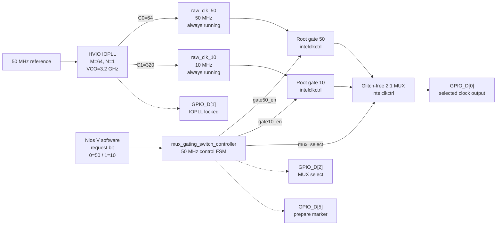
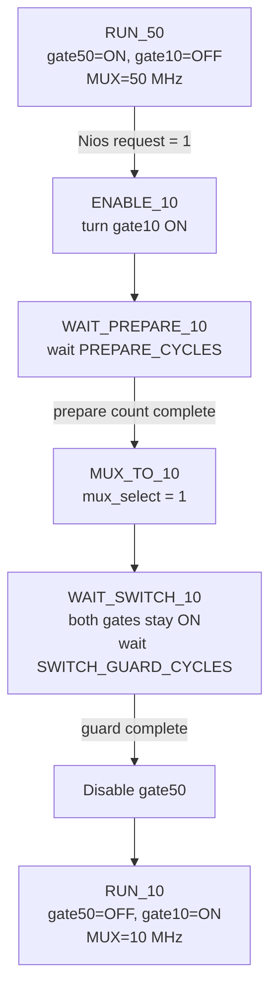
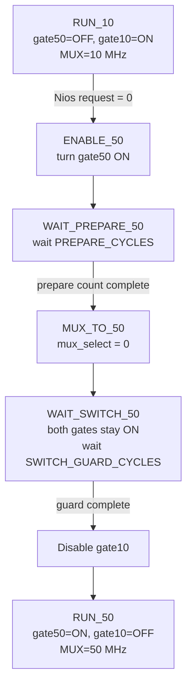
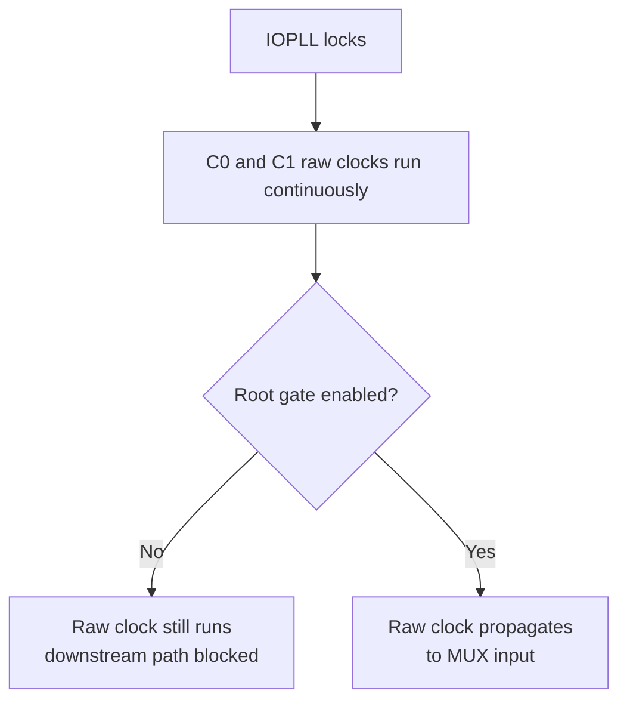
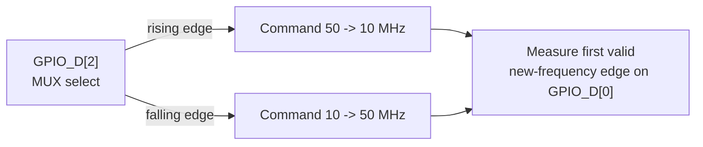

# Agilex 5 HVIO IOPLL dual-clock MUX + gating experiment

This repository demonstrates a **Nios V controlled 50 MHz ↔ 10 MHz clock switch** using two continuously generated HVIO IOPLL outputs, Agilex 5 root clock gating, and a glitch-free Clock Control MUX.

> **Core idea:** Nios V only requests the target frequency. The RTL controller performs the precise sequence: **enable the target clock path → wait → command the MUX → keep both paths available during the switch guard → disable the old gated path**.

This is a separate `mux_gating` experiment derived architecturally from `../iopll_niosv_50_10_glitch_free_mux`. It does **not** dynamically change the IOPLL and does not replace the MUX-only baseline.

---

## 1. Quick mental model

Before reading the register, timing, or measurement details, keep these five points in mind:

1. The IOPLL generates **50 MHz and 10 MHz continuously**.
2. A gate enable does **not** start or stop the IOPLL/C counter; it only allows an already-running raw clock into the downstream clock path.
3. Nios V writes only one request bit: `0 = 50 MHz`, `1 = 10 MHz`.
4. The RTL FSM owns all precise gate/MUX timing.
5. During a transition, the **new path is made available before the MUX command**, and the **old path stays available until after the switch guard**.

### System block diagram



### What changes and what does not

| Item | During 50 ↔ 10 MHz switching |
|---|---|
| IOPLL VCO | Continues running |
| C0 / raw 50 MHz | Continues running |
| C1 / raw 10 MHz | Continues running |
| Target root gate | Enabled before MUX command |
| MUX select | Changes after `PREPARE_CYCLES` |
| Old root gate | Disabled only after `SWITCH_GUARD_CYCLES` |
| PLL reset / recalibration / relock | **Not used** |

---

## 2. Clock-switching flow

The transition is intentionally split into **Prepare**, **MUX command**, and **Guard/Cleanup** phases.

### 50 MHz → 10 MHz



### 10 MHz → 50 MHz



### Why the order matters


The selected source is therefore **never intentionally gated off before the MUX command**. The Clock Control MUX has no switchover-complete output, so the old path remains enabled for a conservative fixed guard interval before cleanup.

---

## 3. Transition timing at a glance

The controller runs from the 50 MHz control clock:

```text
T_control = 1 / 50 MHz = 20 ns
```

Default parameters:

```systemverilog
PREPARE_CYCLES      = 4
SWITCH_GUARD_CYCLES = 50
```

Therefore:

```text
T_prepare(default) = 4  × 20 ns = 80 ns
T_guard(default)   = 50 × 20 ns = 1 us
```

`1 us` is ten periods of the slowest 10 MHz source.

### 50 → 10 MHz timing concept

```text
Time  ---------------------------------------------------------------------->

Nios request     0 _________|‾‾‾‾‾‾‾‾‾‾‾‾‾‾‾‾‾‾‾‾‾‾‾‾‾‾‾‾‾‾

Gate 10 enable   0 _________|‾‾‾‾‾‾‾‾‾‾‾‾‾‾‾‾‾‾‾‾‾‾‾‾‾‾‾‾‾‾
                           <--- 80 ns --->

MUX select       0 ______________________|‾‾‾‾‾‾‾‾‾‾‾‾‾‾‾‾‾
                                      ^ MUX command
                                      |<---- 1 us guard ---->|

Gate 50 enable   1 ‾‾‾‾‾‾‾‾‾‾‾‾‾‾‾‾‾‾‾‾‾‾‾‾‾‾‾‾‾‾‾‾‾‾‾‾|___

Output            50 MHz ---------[ Clock Control switchover ]---- 10 MHz
```

The MUX IP does not expose a completion handshake, so the exact internal switchover instant is measured from the output waveform rather than inferred from the guard counter.

### Phase table

| Phase | gate50 | gate10 | MUX select | Output / purpose |
|---|---:|---:|---:|---|
| `RUN_50` | 1 | 0 | 0 | 50 MHz active |
| Prepare 10 | 1 | 1 | 0 | 50 MHz still drives output while 10 MHz path becomes available |
| Switch guard | 1 | 1 | 1 | Clock Control IP performs switchover; both sources remain available |
| `RUN_10` | 0 | 1 | 1 | 10 MHz active; old downstream 50 MHz path gated |

The reverse transition is symmetric.

---

## 4. RTL state machine and programmable intervals

Nios V writes one requested-frequency bit (`0=50 MHz`, `1=10 MHz`). It never bit-bangs gate or select timing. The 50 MHz RTL controller performs:

```text
RUN_50 -> ENABLE_10 -> WAIT_PREPARE_10 -> MUX_TO_10
       -> WAIT_SWITCH_10 -> disable gate50 -> RUN_10

RUN_10 -> ENABLE_50 -> WAIT_PREPARE_50 -> MUX_TO_50
       -> WAIT_SWITCH_50 -> disable gate10 -> RUN_50
```

At the end of exactly `PREPARE_CYCLES`, the internal `transition_marker` and the actual MUX select command change on the same control edge. The external switch reference is `GPIO_D[2]`, which exposes the MUX select level itself; the internal transition marker is no longer routed to GPIO.

`prepare_marker` rises with target gate enable. With the default `PREPARE_CYCLES=4`, the target gate remains enabled for 80 ns before the MUX command while the old source continues to drive the output.

`PREPARE_CYCLES=0` intentionally commands gate enable and MUX selection on the same control edge for the sweep baseline; the old path still remains enabled during and after this command.

The Clock Control MUX has no completion output. `WAIT_SWITCH_*` therefore keeps both paths enabled for 50 system cycles = 1 us before disabling the old path. Hardware measurements can justify reducing this conservative guard later.

Initial state is gate 50 enabled, gate 10 disabled, and MUX selecting 50 MHz.

---

## 5. Actual clock startup vs. gate behavior

A common source of confusion is the word **enable**. In this design, enabling a root gate does not start the IOPLL output.



Reset/idle and both transitions are therefore:

```text
Reset/RUN_50:
  raw 50 and raw 10 running -> gate50 ON, gate10 OFF -> MUX select=0 -> 50 MHz output

50 -> 10 MHz:
  Nios request=1 -> gate10 ON -> wait 4 x 20 ns -> GPIO_D[2] rises / MUX select=1
  -> keep both gates ON for 50 x 20 ns -> gate50 OFF -> RUN_10

10 -> 50 MHz:
  Nios request=0 -> gate50 ON -> wait 4 x 20 ns -> GPIO_D[2] falls / MUX select=0
  -> keep both gates ON for 50 x 20 ns -> gate10 OFF -> RUN_50
```

The 80 ns preparation occurs while the old clock still drives `GPIO_D[0]`. The 1 us switch guard begins with the MUX-select command and keeps both paths available while the glitch-free Clock Control IP switches. Disabling the old gate afterward does not stop its raw IOPLL output.

The software only changes the requested frequency every 1 second; all precise timing above is RTL timed.

---

## 6. Clock resources used

Quartus Pro 26.1 Clock Control FPGA IP (`intelclkctrl` 2.0.1) is used for all clock gating and switching.

Each one-input gate is configured with:

- `ENABLE=true`
- `ENABLE_TYPE=1` — root level
- `ENABLE_REGISTER_TYPE=1` — negative latch

The two-input output MUX has glitch-free switchover enabled. There is no `clk & enable` clock path in design RTL.

This follows the Agilex 5 clocking model: an IOPLL output can be dynamically gated at the clock network, and root gating stops more downstream clock-tree activity than register clock-enables.

The IOPLL register interface is tied idle. M/N/C0/C1 are fixed, and normal transitions perform no PLL reset, reconfiguration, recalibration, or relock.

Official references:

- [Agilex 5 Clock Control Features](https://www.intel.com/content/www/us/en/docs/programmable/813671/24-3/clock-control-features.html)
- [Agilex 5 HVIO I/O PLL reconfiguration](https://www.intel.com/content/www/us/en/docs/programmable/813671/24-2/implementing-hvio-i-o-pll-reconfiguration.html)
- [Quartus recommended clock-gating methods](https://www.intel.com/content/www/us/en/docs/programmable/683082/25-1/recommended-clock-gating-methods.html)

---

## 7. GPIO and oscilloscope procedure

The existing QSF pin assignments were preserved rather than remapped blindly.

| GPIO | Pin | Signal | Meaning |
|---|---|---|---|
| `GPIO_D[0]` | `PIN_BK31` | final output | Post-gate glitch-free MUX output |
| `GPIO_D[1]` | `PIN_BE43` | `target_iopll_locked` | Raw IOPLL lock indication |
| `GPIO_D[2]` | `PIN_BF29` | `mux_select_10mhz` | Actual MUX selection: 0=50 MHz, 1=10 MHz |
| `GPIO_D[3]` | `PIN_BF40` | gated 50 MHz | Post-gating C0 path |
| `GPIO_D[4]` | `PIN_BK28` | gated 10 MHz | Post-gating C1 path |
| `GPIO_D[5]` | `PIN_BM31` | preparation marker | High from target-gate enable until transition completes |

### Minimum two-channel measurement

Probe:

- **CH1: `GPIO_D[2]`** — actual MUX select / trigger reference
- **CH2: `GPIO_D[0]`** — final output clock



When D2 is low, D0 is 50 MHz. The D2 rising edge commands 50-to-10 MHz, and D2 high corresponds to 10 MHz. The D2 falling edge commands 10-to-50 MHz, and D2 low corresponds to 50 MHz.

Trigger on either D2 edge and measure the first valid new-frequency edge on D0 from that same D2 edge.

### Full six-channel validation

Also confirm that:

- the target gated clock is present before the `GPIO_D[2]` edge,
- the old gated clock stops only after output switchover,
- IOPLL lock remains asserted.

Raw IOPLL clocks are available internally as `target_iopll_outclk0/1`; only the post-gating versions are exported because those are the useful experiment data.

---

## 8. Measurement definitions

| Metric | Definition |
|---|---|
| `T_prepare` | MUX command / `GPIO_D[2]` edge minus preparation-marker rise |
| `T_enable` | First valid target gated-clock edge minus preparation-marker rise |
| `T_switch` | First valid edge at the new selected frequency minus corresponding `GPIO_D[2]` edge |
| `T_gap` | First valid new-frequency edge minus last valid old-frequency edge |
| `T_HIGH_min` | Minimum output HIGH pulse width around the boundary |
| `T_LOW_min` | Minimum output LOW pulse width around the boundary |
| `T_total` | Request-to-completed-state controller latency |

For nonzero settings:

```text
T_prepare = PREPARE_CYCLES × 20 ns
```

`T_total` and `T_gap` are intentionally different. Target preparation overlaps the still-running old output, so preparation may be hundreds of nanoseconds while visible interruption remains short.

In addition to the metrics above, inspect for:

- runt/truncated pulses,
- stretched cycles,
- double edges,
- missing edges.

---

## 9. Architecture comparison

| Property | A: Dynamic C-counter | B: Dual-clock MUX | C: MUX + gating |
|---|---:|---:|---:|
| Raw clocks pre-generated continuously | No | Yes | Yes |
| Dynamic C divider/reset/recalibration | Yes | No | No |
| Glitch-free Clock Control MUX | No | Yes | Yes |
| Unselected downstream path gated | No | No | Yes |
| PLL expected to stay locked in switch | No | Yes | Yes |

The goal of gating is **not faster switching**. It tests reduced unnecessary downstream clock-switching activity versus target-clock wake-up/preparation overhead while trying to keep `T_gap` small.

Functional simulation proves neither power reduction nor analog glitch freedom. Power Analyzer results would be estimates; board power instrumentation is required for measured savings.

---

## 10. Build and verification

`software/nios_mux_gating_switch` is the only application for this experiment. It writes only the requested-frequency PIO and never performs IOPLL runtime reconfiguration, reset, or recalibration.

Generate/update `software/nios_bsp` locally from the Platform Designer system before building the application; the generated BSP and build products are intentionally excluded from Git.

```bash
quartus_sh --flow compile mux_gating_top
./simulation/run_dual_clock_mux_gating.sh
cmake -S software/nios_mux_gating_switch -B software/nios_mux_gating_switch/build
cmake --build software/nios_mux_gating_switch/build
```

### Simulation coverage

Simulation uses the generated Clock Control MUX model and a negative-latched behavioral model of the two root gates. It checks:

- startup at 50 MHz,
- preparation before selection,
- delayed old-clock gating,
- reverse transition,
- PLL lock,
- minimum 10 ns digital pulse width,
- assertions against disabled selected sources,
- assertions against both sources disabled,
- assertions against premature old-source gating.

The simulation script automatically sweeps `PREPARE_CYCLES` through:

```text
0, 1, 2, 4, 8, 16, 32
```

All seven settings pass.

The testbench separately counts raw C0/C1-model edges while their downstream gates are disabled, proving that gate state does not control raw clock generation in the model. It also checks that the internal transition marker and MUX command coincide, both gates are enabled at the MUX command, and old-path disable occurs only after the full switch guard.

Hardware measurements use `GPIO_D[2]`, not the internal marker.

### Quartus 26.1 compile/timing status

- **IP generation check:** PASS, 0 errors and 0 warnings. Existing generated files were current, so Quartus regeneration policy skipped rewriting them.
- **Functional simulation / PREPARE sweep:** PASS for all seven values.
- **Nios V software build:** PASS; `nios_mux_gating_switch.elf` rebuilt successfully.
- **Full compile:** PASS; Fitter successful and `mux_gating_top.sof` generated.
  - Worst setup slack: `+8.421 ns`
  - Worst hold slack: `+0.033 ns`
  - Worst minimum-pulse-width slack: `+3.661 ns`
  - Reported TNS: `0`
  - Resource use: `6,155 ALMs`, `7,288 registers`, `1 PLL`
  - Fitter placement confirms both gates use Agilex 5 `CLK_GATE` resources.

The Clock Control control inputs are false-pathed because their dedicated negative-latch/glitch-free circuits consume asynchronous commands; ordinary register setup/hold does not describe those resource interfaces.

Timing warnings retained for review:

- reserved JTAG TCK and the inherited board manager 1 Hz divider lack explicit clock assignments,
- three invalid `set_net_delay` warnings originate in generated Nios V debug CDC SDC,
- Timing Analyzer consequently reports the whole board-template design is not fully constrained,
- Design Assistant reports inherited missing I/O delays and asynchronous-reset findings.

The final Timing Analyzer reports **0 errors and 9 warnings**, and states timing requirements were met. There are no PLL-setting, invalid-generated-clock, missing-exclusive-clock-group, pulse-collapse, setup, hold, or minimum-pulse-width violations.

---

## 11. Limitations

- The MUX IP exposes no switchover-complete handshake, so old-clock disable uses a conservative cycle guard.
- The digital testbench cannot model clock-tree analog behavior, silicon PVT, oscilloscope loading, or power.
- Final glitch/pulse-width/latency claims require hardware captures.
- Final power claims require matched Power Analyzer assumptions or physical board power measurements.

---

## One-line summary

```text
Nios request -> enable target gated path -> wait -> switch glitch-free MUX
             -> keep both paths alive during guard -> gate off old downstream path
```

The IOPLL itself keeps both raw clocks running throughout the entire experiment.
