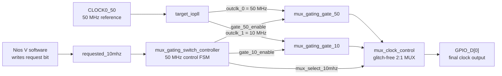
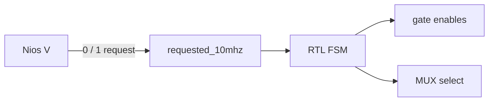
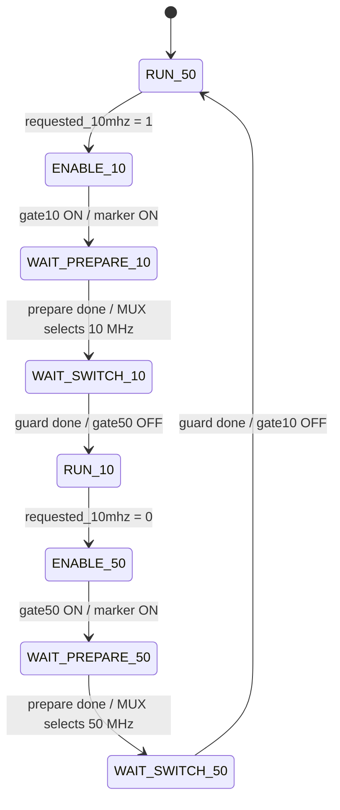
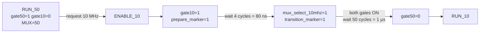
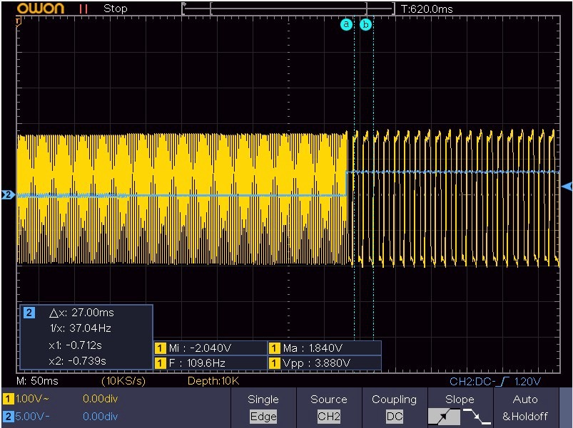
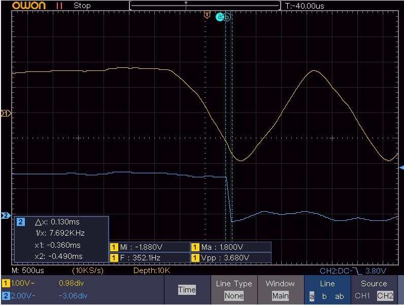
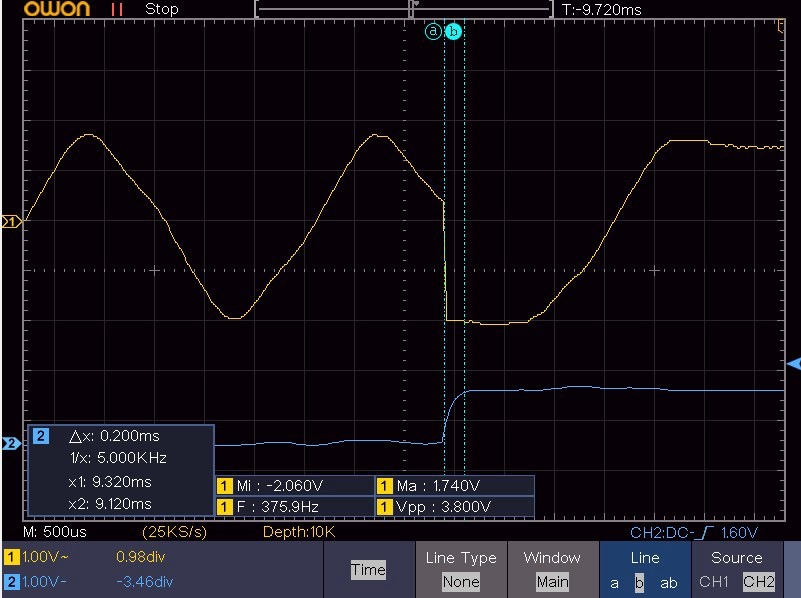

# Agilex 5 HVIO IOPLL 50 MHz ↔ 10 MHz MUX + Root Gating

This repository implements **runtime switching between two continuously generated IOPLL clocks** using dedicated clock-gating resources followed by a glitch-free Clock Control MUX.

> **Current design:** HVIO IOPLL generates 50 MHz and 10 MHz continuously → target path is enabled → RTL waits a programmable preparation interval → RTL changes the MUX select → both paths remain enabled for a guard interval → old path is disabled.

The normal 50 MHz ↔ 10 MHz transition **does not reconfigure the IOPLL**. The IOPLL register interface is tied idle in `mux_gating_top.v`; M/N/C settings are not rewritten during a switch.

---

## 1. What the project actually does



### Important distinction

The IOPLL outputs are **raw clocks that continue running**. The two Clock Control gate IPs only control whether each raw clock propagates into the downstream MUX input.

```text
IOPLL outclk_0 (50 MHz) ──> gate 50 ──┐
                                      ├─> glitch-free MUX ──> output
IOPLL outclk_1 (10 MHz) ──> gate 10 ──┘
```

So:

- gate OFF does **not** stop the IOPLL,
- gate ON does **not** start or relock the IOPLL,
- normal frequency switching does **not** perform PLL reset/reconfiguration/recalibration.

The configured IOPLL IP exposes a 50 MHz `outclk_0` and a 10 MHz `outclk_1` from a 50 MHz reference clock.

---

## 2. Control ownership

Nios V does **not** directly toggle the gate enables or bit-bang the MUX timing.

The software only writes one request bit:

```c
request_frequency(0u); // request 50 MHz
request_frequency(1u); // request 10 MHz
```

The current application waits one second at each requested frequency. All short timing intervals are implemented by RTL in `mux_gating_switch_controller.sv`.



---

## 3. Actual RTL state machine

The current controller has **eight states**:

```text
RUN_50
ENABLE_10
WAIT_PREPARE_10
WAIT_SWITCH_10
RUN_10
ENABLE_50
WAIT_PREPARE_50
WAIT_SWITCH_50
```

There are **no `MUX_TO_10` or `MUX_TO_50` states** in the current RTL. The MUX select changes inside `WAIT_PREPARE_*` when the preparation counter completes, or directly in `ENABLE_*` when `PREPARE_CYCLES == 0`.



### `PREPARE_CYCLES == 0`

This is a special baseline case implemented in the RTL:

- target gate enable and MUX command occur on the **same 50 MHz control edge**,
- the old gate still remains enabled through `SWITCH_GUARD_CYCLES`.

---

## 4. Exact 50 MHz → 10 MHz sequence

With the default parameters:

```systemverilog
PREPARE_CYCLES      = 4
SWITCH_GUARD_CYCLES = 50
```

and a 50 MHz controller clock:

```text
1 control cycle = 20 ns
prepare interval = 4 × 20 ns = 80 ns
guard interval   = 50 × 20 ns = 1 µs
```

The forward transition is:



The reverse 10 MHz → 50 MHz sequence is symmetric:

```text
RUN_10
  -> enable gate50
  -> wait PREPARE_CYCLES
  -> mux_select_10mhz = 0
  -> keep both gates enabled for SWITCH_GUARD_CYCLES
  -> disable gate10
  -> RUN_50
```

This is a **make-before-break clock-path sequence**: the target gated path is made available before the old path is removed.

---

## 5. Marker signals — what they really mean

This section is important because the marker names can be misleading.

### `prepare_marker`

`prepare_marker` rises on the same control edge that enables the target gate, but it **does not fall at the MUX command**.

It remains HIGH through:

```text
target gate enable
      ↓
PREPARE_CYCLES
      ↓
MUX command
      ↓
SWITCH_GUARD_CYCLES
      ↓
old gate disable
      ↓
prepare_marker LOW
```

Therefore `prepare_marker` is better interpreted as a **transition-active window starting at target-path enable**, not as a pulse whose width equals only the 80 ns preparation interval.

### `transition_marker`

`transition_marker` rises when the RTL commands the MUX selection change and remains HIGH through the switch guard. It is currently an internal controller signal and is **not exported on the GPIO mapping in `mux_gating_top.v`**.

### `mux_select_10mhz`

This is the actual selection command sent to `mux_clock_control`:

```text
0 -> gated 50 MHz input selected
1 -> gated 10 MHz input selected
```

For correlating the final output with the **MUX command**, this is the relevant signal.

---

## 6. Current GPIO debug exports

The current top-level RTL exports these signals:

| GPIO | Current RTL signal | Meaning |
|---|---|---|
| `GPIO_D[0]` | `mux_gating_clock_out` | Final clock after gates + MUX |
| `GPIO_D[1]` | `target_iopll_locked` | IOPLL hardware lock status |
| `GPIO_D[2]` | `mux_select_10mhz` | Actual MUX select command |
| `GPIO_D[3]` | `gated_clk_50` | 50 MHz path after its clock gate |
| `GPIO_D[4]` | `gated_clk_10` | 10 MHz path after its clock gate |
| `GPIO_D[5]` | `prepare_marker` | Transition-active marker beginning at target-gate enable |

Physical package-pin assignments should be read from `mux_gating_top.qsf`; they are intentionally not duplicated here so this README does not become stale when pin assignments change.

---

## 7. How to measure the experiment

There are two different questions, and they should not be mixed together.

### A. Output switching behavior

Use:

```text
GPIO_D[2] = MUX command
GPIO_D[0] = final output
```

For 50 MHz → 10 MHz, trigger on the rising edge of `GPIO_D[2]` and inspect when `GPIO_D[0]` begins behaving as the 10 MHz selected output.

For 10 MHz → 50 MHz, trigger on the falling edge of `GPIO_D[2]`.

### B. Gating sequence

To directly verify the gating order, observe:

```text
GPIO_D[3] = gated 50 MHz path
GPIO_D[4] = gated 10 MHz path
GPIO_D[5] = transition-active marker
GPIO_D[2] = MUX command
```

The expected forward ordering is:

```text
gated 10 MHz becomes available
        ↓
80 ns preparation interval
        ↓
MUX command changes to 10 MHz
        ↓
1 µs guard with both paths available
        ↓
gated 50 MHz path is removed
```

The three oscilloscope captures currently stored in this repository show the board-level transition at different time scales. They are useful visual evidence of the observed transition, but a two-channel capture of output + MUX select alone does **not** directly prove target-gate-enable timing or old-gate-disable timing.

---

## 8. Hardware captures

### Overview



### Transition zoom



### Boundary close-up



At long timebases, a 50 MHz or 10 MHz waveform can be heavily undersampled by the oscilloscope display. These images should therefore not be used alone to make nanosecond-level runt-pulse or minimum-pulse-width claims.

---

## 9. Clock-control IP used by the design

The project contains separate Clock Control IP blocks for:

```text
ip/mux_gating_gate_50
ip/mux_gating_gate_10
ip/mux_clock_control
```

The gate IP configuration uses Clock Control enable support with:

```text
ENABLE = true
ENABLE_TYPE = 1
ENABLE_REGISTER_TYPE = 1
```

The two gated outputs then feed the separate two-input Clock Control MUX.

There is no user-RTL implementation of clock gating using a simple expression such as:

```verilog
assign gated_clk = clk & enable;
```

---

## 10. IOPLL runtime-reconfiguration interface

The top-level still contains inherited Nios/IOPLL bridge-related signals and Platform Designer ports, but in this project the actual IOPLL Avalon register interface is explicitly held idle:

```verilog
core_avl_address   = 0
core_avl_read      = 0
core_avl_write     = 0
core_avl_writedata = 0
```

The legacy bridge return signals are also tied to idle values. They **cannot control the normal frequency transition in this implementation**.

This repository should therefore be understood as:

> **pre-generated 50 MHz + 10 MHz clocks, root gating, then glitch-free MUX selection**

—not as an IOPLL dynamic C-counter reconfiguration design.

---

## 11. Key source files

```text
README.md
mux_gating_top.v
rtl/mux_gating_switch_controller.sv
mux_gating_control_system.qsys
ip/target_iopll/
ip/mux_gating_gate_50/
ip/mux_gating_gate_10/
ip/mux_clock_control/
software/nios_mux_gating_switch/main.c
doc/img/
```

Recommended reading order:

```text
README.md
   ↓
rtl/mux_gating_switch_controller.sv
   ↓
mux_gating_top.v
   ↓
software/nios_mux_gating_switch/main.c
```

---

## 12. One-sentence model

> **Both IOPLL output clocks run continuously; Nios V requests a target frequency, and the RTL enables the target clock path, waits the preparation interval, commands the glitch-free MUX, waits the guard interval, and only then disables the old gated path.**
