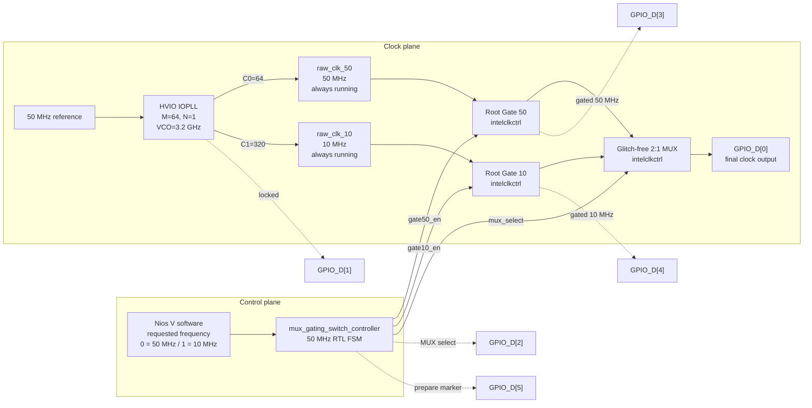
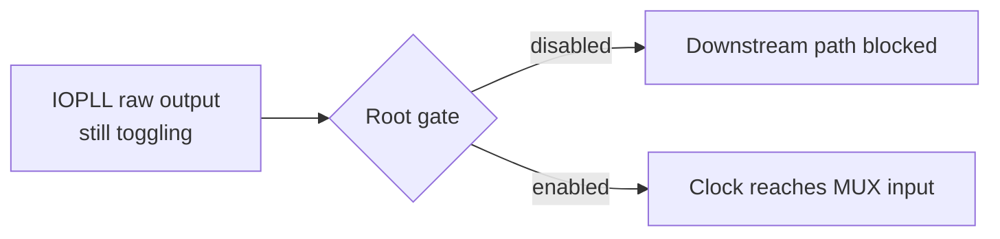
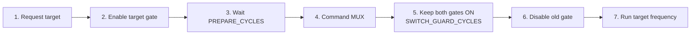
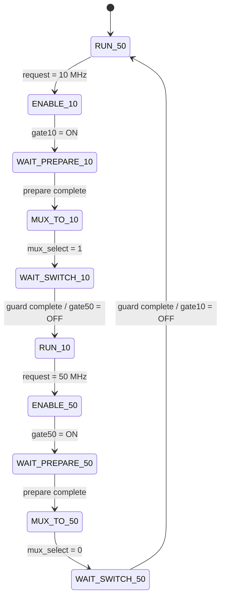
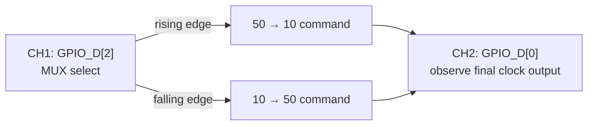
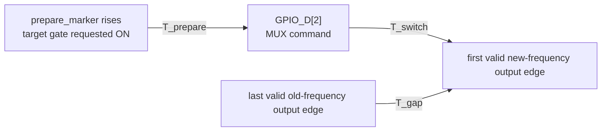

# Agilex 5 HVIO IOPLL Dual-Clock MUX + Root Gating

**Nios V controlled 50 MHz ↔ 10 MHz clock switching using two continuously running HVIO IOPLL outputs, Agilex 5 root clock gates, and a glitch-free Clock Control MUX.**

> **Design principle:** software chooses the target frequency; RTL owns the timing.  
> **Switch sequence:** enable target path → prepare → command MUX → guard → disable old path.

This repository is the **MUX + gating experiment**. It does **not** dynamically reconfigure the IOPLL during a normal 50 MHz ↔ 10 MHz transition.

---

## Experiment at a glance

| Item | This design |
|---|---|
| FPGA clock source | HVIO IOPLL |
| Raw outputs | 50 MHz (`C0=64`) and 10 MHz (`C1=320`) |
| VCO | 3.2 GHz (`M=64`, `N=1`) |
| Clock switching | 2:1 glitch-free `intelclkctrl` MUX |
| Clock gating | Two root-level `intelclkctrl` gates |
| Software control | One requested-frequency bit from Nios V |
| Timing owner | 50 MHz RTL FSM |
| Default prepare interval | `4 × 20 ns = 80 ns` |
| Default switch guard | `50 × 20 ns = 1 µs` |
| PLL reconfiguration during switch | **None** |
| Primary measurement | `GPIO_D[2]` MUX select vs. `GPIO_D[0]` output |

### Experimental question

Can the unselected downstream clock path be gated while preserving a controlled, glitch-free clock-source transition and keeping the IOPLL running continuously?

The experiment separates three effects that are easy to confuse:

1. **Raw clock generation** — both IOPLL outputs keep running.
2. **Clock-path availability** — root gates decide whether each raw clock reaches the MUX.
3. **Output selection** — the glitch-free MUX decides which available source reaches the output.

---

## 1. System architecture

### Clock plane + control plane



### The most important distinction



**Gate disabled ≠ IOPLL clock stopped.** The gate only blocks propagation into the downstream clock network. C0, C1, and the VCO continue running.

### Design invariants

These rules define the intended behavior of every valid transition:

- both raw IOPLL outputs continue running,
- the target gated path is enabled **before** the MUX command,
- both gated sources are available at the MUX command,
- the selected source is never intentionally gated off before switchover,
- the old gated path is disabled only after the full switch guard,
- IOPLL lock is expected to remain asserted,
- no PLL reset, C-counter update, recalibration, or relock is part of a normal switch.

---

## 2. Switching sequence

A frequency change is a **make-before-break** operation at the gated clock-path level.



### Forward and reverse transitions

| Phase | 50 → 10 MHz | 10 → 50 MHz |
|---|---|---|
| Initial | gate50 ON, gate10 OFF, MUX=50 | gate50 OFF, gate10 ON, MUX=10 |
| Wake target path | enable gate10 | enable gate50 |
| Prepare | wait `PREPARE_CYCLES` | wait `PREPARE_CYCLES` |
| MUX command | `mux_select=1` | `mux_select=0` |
| Guard | both gates ON | both gates ON |
| Cleanup | disable gate50 | disable gate10 |
| Final | gate50 OFF, gate10 ON, MUX=10 | gate50 ON, gate10 OFF, MUX=50 |

### Why the guard exists

The Clock Control MUX has no switchover-complete output. The controller therefore cannot observe the exact internal completion instant. It keeps both clock paths available for a conservative fixed interval, then disables the old gated path.

The guard is **not** the measured switching latency. Actual output switchover is determined from `GPIO_D[0]`.

---

## 3. RTL state machine



Equivalent RTL sequence:

```text
RUN_50 -> ENABLE_10 -> WAIT_PREPARE_10 -> MUX_TO_10
       -> WAIT_SWITCH_10 -> RUN_10

RUN_10 -> ENABLE_50 -> WAIT_PREPARE_50 -> MUX_TO_50
       -> WAIT_SWITCH_50 -> RUN_50
```

Nios V writes only the requested-frequency bit. It does **not** bit-bang gate enables or MUX timing.

---

## 4. Timing model

The controller uses a 50 MHz clock:

```text
T_control = 1 / 50 MHz = 20 ns
```

Default parameters:

```systemverilog
PREPARE_CYCLES      = 4
SWITCH_GUARD_CYCLES = 50
```

Therefore:

```text
T_prepare(default) = 4  × 20 ns = 80 ns
T_guard(default)   = 50 × 20 ns = 1 µs
```

The 1 µs guard equals ten periods of the slowest 10 MHz source.

### 50 MHz → 10 MHz timing concept

```text
Time  ------------------------------------------------------------------------>

request_10       0 _________|‾‾‾‾‾‾‾‾‾‾‾‾‾‾‾‾‾‾‾‾‾‾‾‾‾‾‾‾‾‾‾‾

gate10_en        0 _________|‾‾‾‾‾‾‾‾‾‾‾‾‾‾‾‾‾‾‾‾‾‾‾‾‾‾‾‾‾‾‾‾
                          |<-- 80 ns -->|

mux_select       0 _____________________|‾‾‾‾‾‾‾‾‾‾‾‾‾‾‾‾‾‾‾‾
                                             ^
                                             | MUX command
                                             |<---- 1 µs guard ---->|

gate50_en        1 ‾‾‾‾‾‾‾‾‾‾‾‾‾‾‾‾‾‾‾‾‾‾‾‾‾‾‾‾‾‾‾‾‾‾‾‾‾‾|___

GPIO_D[0]          50 MHz ---------[ actual switchover ]---------- 10 MHz
```

The old 50 MHz clock continues driving the output during preparation. The MUX command occurs only after the target 10 MHz gated path has been made available.

`PREPARE_CYCLES=0` is intentionally supported as a sweep baseline: target gate enable and MUX command occur on the same control edge, while the old path still remains enabled through the guard.

---

## 5. Hardware measurement: MUX + gating experiment

This is a **gating experiment**, so the measurement model separates two questions:

1. **When does the output MUX switch?** — observe `GPIO_D[2]` against `GPIO_D[0]`.
2. **When are the gated clock paths enabled/disabled?** — observe `GPIO_D[3]`, `GPIO_D[4]`, and `GPIO_D[5]`.

### Primary two-channel trigger view

For the externally visible output transition, use the signal that actually commands the MUX:

> **Trigger reference = `GPIO_D[2]` (`mux_select_10mhz`)**

Do not use `prepare_marker` as the primary output-switch trigger. The marker answers a different question: **when did target-path preparation begin?**



- `GPIO_D[2] = 0` → MUX commands 50 MHz.
- `GPIO_D[2] = 1` → MUX commands 10 MHz.
- Rising edge on D2 → 50 MHz → 10 MHz command.
- Falling edge on D2 → 10 MHz → 50 MHz command.

### Gating validation signals

| GPIO | Pin | Signal | What it proves |
|---|---|---|---|
| `GPIO_D[0]` | `PIN_BK31` | final output | Actual selected output clock |
| `GPIO_D[1]` | `PIN_BE43` | `target_iopll_locked` | PLL remains locked |
| `GPIO_D[2]` | `PIN_BF29` | `mux_select_10mhz` | Actual MUX command / trigger |
| `GPIO_D[3]` | `PIN_BF40` | gated 50 MHz | 50 MHz downstream path availability |
| `GPIO_D[4]` | `PIN_BK28` | gated 10 MHz | 10 MHz downstream path availability |
| `GPIO_D[5]` | `PIN_BM31` | preparation marker | Target-gate preparation interval |

For a complete **gating** validation, confirm all of the following:

- the target gated clock is already present **before** the `GPIO_D[2]` MUX-select edge,
- both gated paths remain available during the MUX transition,
- the old gated clock is removed only **after** the switch guard,
- IOPLL lock remains asserted throughout.

### Hardware captures from the gating build: 50 MHz → 10 MHz

The three oscilloscope captures below show the same forward transition at progressively shorter time scales. Keeping them as separate files preserves the original detail and makes each acquisition easier to interpret on GitHub and on mobile.

#### 1. Overview — 50 ms/div


This long-window capture shows the overall operating-region change from the faster 50 MHz output region to the slower 10 MHz output region.

#### 2. Transition zoom — 2 ms/div


This view zooms in around the `GPIO_D[2]` MUX-select transition so the output behavior around the command boundary is easier to see.

#### 3. Boundary close-up — 500 µs/div


This is the closest view in the current capture set and is intended to inspect the immediate command/output boundary before moving to a true ns-scale pulse-quality acquisition.

**Signals shown in all three captures**

- **CH1 / yellow:** `GPIO_D[0]` — final post-gating, post-MUX clock output.
- **CH2 / blue:** `GPIO_D[2]` — `mux_select_10mhz`, the external MUX-command reference.
- The CH2 rising edge corresponds to the 50 MHz → 10 MHz MUX command.

These captures are hardware evidence of the **output transition produced by the gating architecture**, but they do **not by themselves directly show the gate-enable/disable events**, because `GPIO_D[3]`, `GPIO_D[4]`, and `GPIO_D[5]` are not displayed in this two-channel acquisition.

Therefore, do not interpret these images alone as proof that the target gate turned on 80 ns before the MUX command or that the old gate turned off exactly after the 1 µs guard. Those gating-sequence claims are verified digitally by the RTL/testbench and require the additional gating GPIO channels for direct board-level confirmation.

At the displayed millisecond-scale timebases, the nominal 50 MHz and 10 MHz clock waveforms are heavily undersampled by the oscilloscope display. The yellow traces should therefore not be interpreted as the actual square-wave shape or used directly for nanosecond-level pulse-width claims.

> **Important:** the on-screen cursor `ΔX` values in these captures are not automatically `T_switch`, `T_gap`, `T_prepare`, or `T_enable`. Each metric requires the cursors to be placed on the exact events defined below using a suitable high-sample-rate / short-timebase acquisition.

---

## 6. Measurement definitions



| Metric | Definition | What it tells us |
|---|---|---|
| `T_prepare` | D2 MUX-command edge − prepare-marker rise | Intentional target-path preparation |
| `T_enable` | First valid target gated-clock edge − prepare-marker rise | Actual gated-path enable behavior |
| `T_switch` | First valid new-frequency output edge − D2 edge | Actual MUX/output response |
| `T_gap` | First valid new-frequency edge − last valid old-frequency edge | Visible boundary interruption |
| `T_HIGH_min` | Minimum HIGH pulse width near boundary | Runt/truncated HIGH check |
| `T_LOW_min` | Minimum LOW pulse width near boundary | Runt/truncated LOW check |
| `T_total` | Request → completed FSM state | Controller-level latency |

For nonzero settings:

```text
T_prepare = PREPARE_CYCLES × 20 ns
```

`T_total` and `T_gap` are deliberately different. Preparation overlaps the still-running old output, so a long preparation interval does not imply an equally long visible output gap.

Also inspect for **runt pulses, truncated pulses, stretched cycles, double edges, and missing edges**.

---

## 7. Clock resources

Quartus Pro 26.1 Clock Control FPGA IP (`intelclkctrl` 2.0.1) is used for both gating and clock selection.

Each one-input clock gate is configured with:

```text
ENABLE=true
ENABLE_TYPE=1
ENABLE_REGISTER_TYPE=1
```

This selects root-level gating with the dedicated negative-latch behavior. The output uses a two-input Clock Control MUX with glitch-free switchover enabled.

There is **no `clk & enable` clock path in user RTL**.

The IOPLL register interface is tied idle during this experiment. M/N/C0/C1 stay fixed across normal transitions.

---

## One-sentence model

> **Both IOPLL clocks always run; RTL wakes the target gated path, commands the glitch-free MUX, waits a guard interval, and only then gates off the old downstream path.**